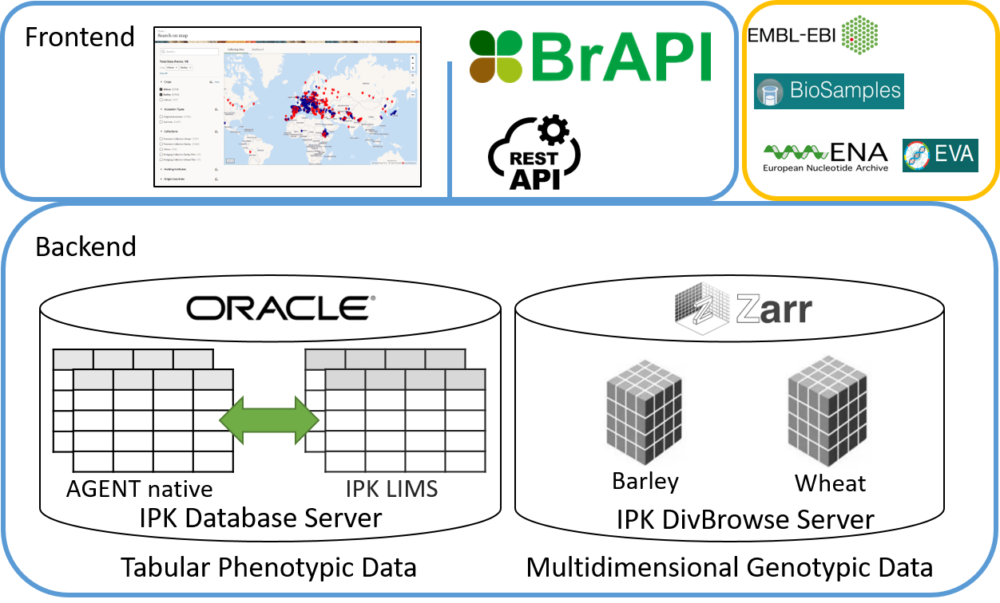

### Federated Data Management Infrastructures
<!-- 
(AGENT, INCREASING, EURISCO, DataPLANT, NFDI4BioDiversity, FAIRAgro)

* General use case description(s) -  AgrosystemIntegration of germplasm collections in context of data trustee models among private economy and public research, integration of ex-situ genebanks (EU H2020 projects AGENT, INCREASING), integrated agrosystems and plant research infrastructure
* Specific tool examples - BraPI endpoints for AGENT, IPK-Genebank, MIAPPE ISA-TAB2BRAPI service
* Alternate solutions/ why is it better with BrAPI - Schema.ORG lightweight meta data harvesting, ARCs as collaborative data decoration, API and publication pipeline
* future related use cases, areas to improve - LIMS to BrAPI proxies -->

<!-- Contribution BrAPI 2.0 paper
Suggested Authors: Matthias Lange, Patrick König, Stephan Weise, Gouripriya Davuluri, Suman Kumar, Joseph Ruff, Paul Kersey, Cyril Pommier, Michael Alaux, Erwan Le-Floch -->
#### AGENT Portal

{#sec:AGENT_BrAPI_Backend}

In the global system for ex situ conservation of plant genetic resources (PGR) [@doi:10.3390/plants10081557], a total of ~5.8 million accessions are conserved in 1750 ex situ genebanks [@doi:10.2135/cropsci2017.01.0014]. Unique and permanent identifiers in the form of DOIs are available for more than 1.7 million accessions [@doi:Food and Agriculture Organization (FAO) The Global Information System for PGRFA]. Each DOI is linked to some basic descriptive data that facilitates the use of these resources. Many DOIs are also linked to additional data from different domains or will be in the future. In order to answer questions on the global biological diversity of a plant species, on duplicate detection, on provenance tracking for the identification of genetic integrity, on the selection of the most suitable material for various purposes, including breeding and research, and to support further applications in data mining or AI, a data space beyond the most basic information is needed that includes genotypic and phenotypic data. In this context, the aim of the AGENT project (https://www.agent-project.eu/) funded by the European Commission is to develop a concept for the digital exploitation and activation of this GenRes data space via European ex situ genebanks according to the FAIR criteria [@doi:10.1038/sdata.2016.18] and to test it in practice using two important crops, barley and wheat. In two work packages, standards and technology for data interoperability will be developed to establish a genetic resources infrastructure, which regulates data acquisition of genotypic and phenotypic data, integrates and archives them and makes them accessible according to FAIR principles. To this end, 13 European genebanks and 5 bioinformatics centers are cooperating and have agreed on standards and protocols for (i) the data flow (see figure {@fig:AGENT_Genotyping_Data_Flow}) and data formats [@doi:10.12688/f1000research.109080.2] for central archiving of genotypic and phenotypic data.
{#fig:AGENT_Genotyping_Data_Flow}

The AGENT portal as described in more detail in section {@sec:Success_Story_AGENT} unlock the full potential of the biological material stored in genebanks around the globe by using FAIR international data standards and an open digital infrastructure for the management of plant genetic resources. The implemented BrAPI interface enables to mine current and historic genotypic and phenotypic information to drive the discovery of genes, traits and knowledge for future missions, complement existing information for wheat and barley and the new data standards and infrastructure to foster an improved management of PGR for other crop species across European genebanks.

For the joint research data infrastructure for the federation of collections of genotypic and phenotypic data from European gene banks and bioinformatics institutes, a AGENT portal ({@fig:AGENT_WebFrontend}) as database infrastructure for integrated plant genetic resources on ex-situ genebanks is being created. It provides, manual data exploration, machine-readable access via BrAPI and provide data to the cored data deposition resources at the European Bioinformatics Institute (EBI).
{#fig:AGENT_WebFrontend}

The AGENT database backend aggregates curated and integrated passport data, phenotypic and genotypic data about wheat and barley accessions of 18 project partners are harmonized and integrated via BrAPI endpoints (https://github.com/AGENTproject/BrAPI) and explorable in a web portal (https://agent.ipk-gatersleben.de). The BrAPI endpoints were made available by scattered implementation. Genotyping data use DivBrowse [@doi:10.1093/gigascience/giad025] storage engine and BrAPI interface. Endpoints for sample data are implemented using AGENT database SQL to BrAPI broker service.
To integrate those BrAPI endpoint provider into a single service and URL scheme, we work on their integration in a BrAPI proxy service. As next steps, we will expand BrAPI implementation to enable the integration of analysis pipelines in the AGENT portal, e.g. for genebank mining tools such as the FIGS+ pipeline developed by AGENT partner ICARDA [@doi:10.22004/AG.ECON.266624]. Another perspective is to integrate the data collected in the AGENT project into the European Search Catalogue for Plant Genetic Resources (EURISCO) [@doi:10.1093/nar/gkac852] and to implement BrAPI endpoints to make data on PGR collections in European genebanks programmatically accessible.

#### IPK-Genebank

<!-- Peter S: Stub paragraph to stimulate the writing process. Please edit, rewrite, or delete as needed. -->
Agrosystem Integration of germplasm collections in context of data trustee models among private economy and public research, integration of ex-situ genebanks (EU H2020 projects AGENT, INCREASING), integrated agrosystems and plant research infrastructure

#### MIAPPE "BrAPI to ISA" service

Since the release of BrAPI 1.3, efforts have been made to incorporate support for the Minimum Information About Plant Phenotyping Experiments (MIAPPE) standard into the specification [@doi:10.1111/nph.16544]. This integration was finalized in BrAPI 2.0, resulting in full compatibility between the two standards. Consequently, BrAPI now encompasses all attributes necessary for MIAPPE compliance, adhering to standardized descriptions in accordance with MIAPPE guidelines. Leveraging BrAPI as a standardized RESTful web service API specification, we employ the ISA standard for storing metadata and phenotyping data in a standardized manner. This data is structured in the ISA-TAB file format and subjected to validation using the [MIAPPE ISA configuration](https://github.com/ELIXIR-Belgium/isatab-validation). The "BrAPI to ISA" service functions as a converter between BrAPI RESTful endpoints and ISA-TAB, facilitating the archiving of metadata and data and thereby enhancing data preservation and accessibility. The [BrAPI2ISA](https://github.com/elixir-europe/plant-brapi-to-isa) tool is designed to be compatible with BrAPI 1.3, and we invite contributions from the community to extend support for the latest versions of BrAPI.
